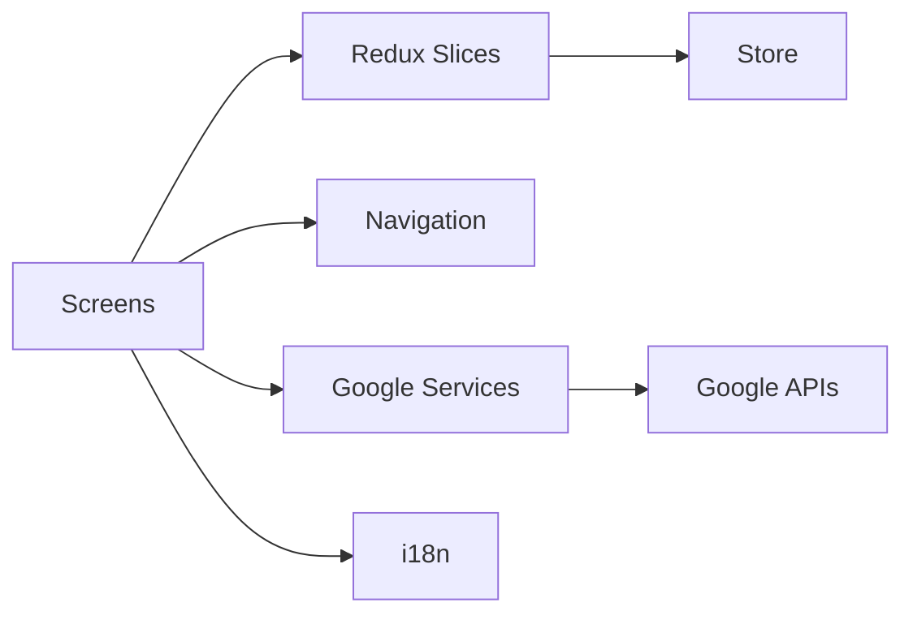

# Guia de Estudio - Sustentacion Completa

Proyecto: ProyectoUberMovil  
Fecha: 2026-05-24  
Stack: React Native CLI + Redux Toolkit + React Navigation + Google Maps APIs + i18n

## 1. Objetivo del proyecto

Construir una app movil tipo Uber que permita:

- Buscar destino con Autocomplete de Google.
- Obtener origen por GPS del dispositivo.
- Calcular ruta, distancia y ETA.
- Mostrar opciones de viaje y tarifa estimada.
- Guardar y editar perfil del usuario.
- Soportar idiomas ES/EN.

## 2. Arquitectura general

La app sigue una separacion por capas:

- UI: pantallas y navegacion.
- Estado global: Redux store y slices.
- Servicios: clientes a APIs externas.
- Soporte transversal: i18n, permisos, validaciones.



## 3. Estructura del proyecto que debes dominar

### Entry point

- [App.tsx](App.tsx)

Responsabilidad:

- Monta Provider de Redux.
- Monta SafeAreaProvider.
- Inicializa i18n.
- Renderiza el navegador principal.

### Navegacion

- [src/navigation/AppNavigator.js](src/navigation/AppNavigator.js)

Responsabilidad:

- Define stack principal.
- Registra Home, RideOptions y Profile.

Pantallas activas:

- [src/screens/HomeScreen.js](src/screens/HomeScreen.js)
- [src/screens/RideOptionsScreen.js](src/screens/RideOptionsScreen.js)
- [src/screens/ProfileScreen.js](src/screens/ProfileScreen.js)

Pantalla implementada pero no integrada al stack principal:

- [src/screens/TripHistoryScreen.js](src/screens/TripHistoryScreen.js)

### Estado global (Redux)

- [src/store/store.js](src/store/store.js)
- [src/store/slices/rideSlice.js](src/store/slices/rideSlice.js)
- [src/store/slices/userSlice.js](src/store/slices/userSlice.js)

Modelo mental:

- rideSlice guarda origen, destino, ruta, distancia, ETA y vehiculo.
- userSlice guarda nombre, email, telefono y genero.

### Servicios API

- [src/utils/googleClient.js](src/utils/googleClient.js)
- [src/utils/autocompleteServices.js](src/utils/autocompleteServices.js)
- [src/utils/playDetailServices.js](src/utils/playDetailServices.js)
- [src/utils/directionsService.js](src/utils/directionsService.js)
- [src/utils/distanceMatrixService.js](src/utils/distanceMatrixService.js)

Responsabilidad:

- Centralizar llamadas a Google Maps APIs.
- Reutilizar requestGoogle en servicios especificos.

### Internacionalizacion

- [src/i18n/index.js](src/i18n/index.js)
- [src/i18n/locales/es.json](src/i18n/locales/es.json)
- [src/i18n/locales/en.json](src/i18n/locales/en.json)

Responsabilidad:

- Detectar idioma del dispositivo.
- Cargar traducciones ES/EN.
- Permitir cambio de idioma desde Profile.

## 4. Flujo funcional end-to-end (el mas importante para sustentar)

### Flujo Home -> RideOptions

1. Home solicita permiso de ubicacion (Android runtime permission).
2. Home obtiene coordenadas actuales con Geolocation.
3. Usuario escribe destino.
4. Se lanza Autocomplete con debounce para evitar spam de requests.
5. Usuario selecciona sugerencia.
6. Se consulta Place Details y se obtiene lat/lng destino.
7. Se consulta Directions para renderizar Polyline en el mapa.
8. Al pulsar "See ride options", se consulta Distance Matrix.
9. Se hace dispatch a Redux con origen, destino, ruta y metricas.
10. Se navega a RideOptions.

### Flujo RideOptions

1. Lee distancia y ETA desde Redux.
2. Lista categorias de vehiculo.
3. Guarda la opcion seleccionada en Redux.
4. Muestra tarifa mock por categoria.

### Flujo Profile

1. Precarga datos desde userSlice.
2. Valida campos obligatorios.
3. Valida name <= 50.
4. Valida formato email.
5. Valida telefono numerico.
6. Hace dispatch setUserProfile.
7. Permite cambio de idioma ES/EN.

## 5. Preguntas de sustentacion (dificiles) con respuesta modelo

### Q1. Por que usan Redux y no solo useState?

Respuesta corta:

Se eligio Redux porque el estado de viaje se comparte entre pantallas diferentes (Home, RideOptions y futuras pantallas). Redux evita prop drilling, mejora escalabilidad y centraliza la logica.

### Q2. Como evitan costos excesivos en Google Places?

Respuesta corta:

Se usa session token para agrupar Autocomplete + Place Details en una misma sesion de facturacion, y se aplica debounce en entrada de texto para reducir llamadas innecesarias.

### Q3. Que pasa si se cae la red o falla una API?

Respuesta corta:

Se usan bloques try/catch, Alert al usuario y bloqueo de acciones criticas cuando no hay origen o destino valido. La app evita continuar con datos incompletos.

### Q4. Como esta resuelta la internacionalizacion?

Respuesta corta:

i18next se inicializa al arranque, detecta locale del dispositivo y usa fallback. Todas las etiquetas principales usan translation keys y el usuario puede cambiar idioma en Profile.

### Q5. Que parte esta incompleta o en deuda tecnica?

Respuesta corta:

TripHistory existe como modulo mock pero aun no esta integrado completamente al stack y fuente persistente real.

### Q6. Como aseguraron calidad?

Respuesta honesta recomendada:

Hay test base con Jest, pero actualmente existe una incompatibilidad ESM con react-redux en el entorno de prueba que debe ajustarse en config Jest para tener pipeline verde.

## 6. Riesgos actuales y plan de mitigacion

### Riesgo 1: Tests fallando

Estado:

- Jest falla por import ESM de react-redux.

Mitigacion:

- Ajustar transformIgnorePatterns en [jest.config.js](jest.config.js).
- Mockear dependencias RN pesadas para test unitario de App.
- Validar con npm test en CI local.

### Riesgo 2: API key de Google

Estado:

- Hay placeholder en [src/utils/googleClient.js](src/utils/googleClient.js).

Mitigacion:

- Mover la key a .env por entorno.
- Consumirla via react-native-config.
- Restringir key por paquete, SHA y APIs permitidas.

### Riesgo 3: Funcionalidades parciales

Estado:

- TripHistory solo mock.

Mitigacion:

- Integrar ruta en navigator.
- Persistir viajes en backend no relacional (ej. Firebase).
- Mostrar historial real por usuario.

## 7. Checklist de pre-sustentacion (obligatorio)

1. Ejecutar y demostrar Home con mapa, origen y destino.
2. Demostrar RideOptions con distancia y ETA reales.
3. Demostrar validaciones de Profile con casos invalidos y validos.
4. Demostrar cambio de idioma ES/EN.
5. Mostrar estructura de Redux y explicar cada slice.
6. Explicar un error real detectado (testing) y su plan de solucion.
7. Mostrar gestion de seguridad de API key (plan por entorno).
8. Preparar demo de fallo controlado (sin permiso ubicacion o sin red).

## 8. Script de exposicion recomendado (8-10 min)

1. Problema y alcance (1 min).
2. Arquitectura y decisiones tecnicas (2 min).
3. Demo guiada de flujo principal (3 min).
4. Estado global e i18n (1 min).
5. Riesgos, deuda tecnica y roadmap (2 min).
6. Cierre con aprendizajes (1 min).

## 9. Resumen de conceptos clave que debes memorizar

- Diferencia entre Place Autocomplete, Place Details, Directions y Distance Matrix.
- Por que usar debounce y session token.
- Diferencia entre estado local y estado global.
- Validaciones de negocio del perfil.
- Flujo de navegacion stack y paso de estado via Redux.
- Estrategia de manejo de errores y UX minima en fallos.

## 10. Comandos utiles para defender parte tecnica

```bash
npm install
npm start
npm run android
npm run ios
npm test -- --watch=false
```

## 11. Estado tecnico actual (foto real)

- Arquitectura modular y clara: OK.
- Flujo principal de viaje: OK.
- i18n ES/EN operativo: OK.
- Historial de viajes: implementacion inicial (mock), falta integracion completa.
- Testing: con falla de configuracion ESM en Jest.
- Seguridad de credenciales: pendiente mover key a .env y endurecer.

## 12. Cierre para usar en sustentacion

Mensaje final sugerido:

"El proyecto cumple el flujo principal de solicitud de viaje con integracion real de APIs de Google, estado global con Redux y soporte bilingue. Ya identificamos y documentamos deuda tecnica concreta (testing ESM, seguridad de key e integracion completa de historial) con plan de cierre priorizado."
